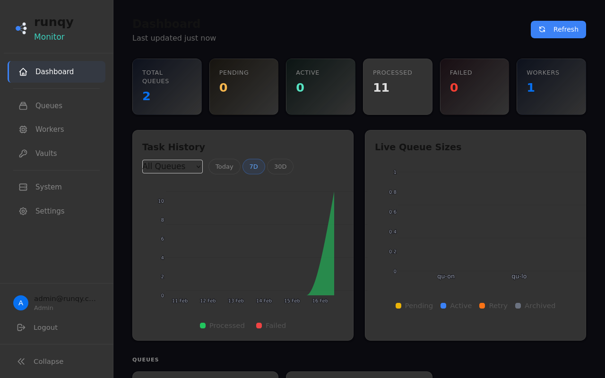

<p align="center">
  
</p>

<h1 align="center">runqy</h1>

<p align="center">
  <strong>Open-source GPU-native task queue for AI workloads. The Modal alternative you can self-host.</strong>
</p>

<p align="center">
  <a href="https://github.com/Publikey/runqy/stargazers"></a>
  <a href="https://github.com/Publikey/runqy/blob/main/LICENSE"></a>
  <a href="https://golang.org/"></a>
  <a href="https://github.com/Publikey/runqy-python"></a>
  <a href="https://github.com/Publikey/runqy/actions"></a>
</p>

<p align="center">
  <a href="https://docs.runqy.com"><strong>Documentation</strong></a> · 
  <a href="https://runqy.com"><strong>Website</strong></a> · 
  <a href="#examples">Examples</a> · 
  <a href="#contributing">Contributing</a>
</p>

---

<p align="center">
  <video src="assets/demo.webm" alt="Runqy demo" width="800" autoplay loop muted></video>
</p>

<p align="center">
  
</p>

---

## Why Runqy?

🎯 **GPU-native workers** — First-class GPU support for ML/AI workloads  
📄 **Deployment YAML** — Zero-touch worker deployment from Git  
🗄️ **Multi-backend** — Redis, PostgreSQL, or SQLite backend storage  
🔐 **Built-in vault** — Secure secrets management with env_vars  
🐍 **Go server + Python SDK** — Robust server, familiar developer experience  
📊 **Web monitoring UI** — Real-time dashboard with Prometheus metrics  

---

## Quick Start

Get Runqy running in under 60 seconds:

```bash
# 1. Start the stack
curl -O https://raw.githubusercontent.com/Publikey/runqy/main/docker-compose.quickstart.yml
docker-compose -f docker-compose.quickstart.yml up -d

# 2. Enqueue a task
pip install runqy-python
python -c "
from runqy_python import RunqyClient
client = RunqyClient('http://localhost:3000', api_key='dev-api-key')
task = client.enqueue('quickstart-oneshot', {'message': 'Hello World!'})
print(f'Task ID: {task.task_id}')
"

# 3. Check results
open http://localhost:3000/monitoring/
```

## Code Example

Write tasks with simple decorators:

```python
from runqy import task, load

@load
def setup():
    """Load models once when worker starts"""
    import torch
    return torch.load('my_model.pt')

@task
def process_image(image_url: str, model) -> dict:
    """Process on every task execution"""
    # GPU-accelerated inference
    result = model.predict(image_url)
    return {"prediction": result, "confidence": 0.95}
```

Deploy with YAML:

```yaml
# deployment/image-processor.yaml
name: image-processor
runtime: python
git_url: https://github.com/your-org/ml-tasks
env_vars:
  MODEL_PATH: /models/resnet50.pt
  GPU_MEMORY: "8GB"
```

## Feature Comparison

| Feature | Runqy | Celery | Temporal | Modal | BullMQ | Inngest |
|---------|-------|--------|----------|-------|--------|---------|
| **GPU Support** | ✅ Native | ❌ | ❌ | ✅ | ❌ | ❌ |
| **Self-hosted** | ✅ | ✅ | ✅ | ❌ | ✅ | ❌ |
| **Deployment YAML** | ✅ | ❌ | ❌ | ✅ | ❌ | ❌ |
| **Vault Secrets** | ✅ | ❌ | ❌ | ✅ | ❌ | ❌ |
| **Multi-backend** | ✅ | ✅ | ✅ | ❌ | ❌ | ❌ |
| **Monitoring UI** | ✅ | ❌ | ✅ | ✅ | ✅ | ✅ |

---

## Examples

Explore real-world use cases:

- **[quickstart-oneshot](examples/quickstart-oneshot/)** — Simple task execution
- **[quickstart-longrunning](examples/quickstart-longrunning/)** — Background processes  
- **[star-runqy](examples/star-runqy/)** — Vault secrets tutorial
- **image-classifier** — GPU-accelerated ML inference *(coming soon)*
- **data-pipeline** — Multi-step data processing *(coming soon)*
- **model-training** — Distributed training jobs *(coming soon)*
- **api-scraper** — Rate-limited web scraping *(coming soon)*

---

## Installation

### Quick Install

**Linux/macOS:**
```bash
curl -fsSL https://raw.githubusercontent.com/publikey/runqy/main/install.sh | sh
```

**Windows (PowerShell):**
```powershell
iwr https://raw.githubusercontent.com/publikey/runqy/main/install.ps1 -useb | iex
```

### Docker

```bash
docker pull ghcr.io/publikey/runqy:latest
```

### From Source

```bash
git clone https://github.com/Publikey/runqy.git
cd runqy
go build -o runqy ./app
```

## Requirements

- **Development:** Built-in SQLite (zero setup)
- **Production:** Redis + PostgreSQL

## Configuration

Configure via environment variables or YAML:

```bash
# Core settings
export REDIS_HOST=localhost:6379
export RUNQY_API_KEY=your-secret-key
export QUEUE_WORKERS_DIR=./deployment

# Optional
export PROMETHEUS_ADDRESS=http://localhost:9090
export VAULT_ENABLED=true
```

See [Configuration Reference](https://docs.runqy.com/server/configuration/) for all options.

## CLI Reference

Manage your deployment locally or remotely:

```bash
runqy queue list                    # List all queues
runqy queue create -f config.yaml  # Deploy queue worker

runqy task enqueue -q myqueue -p '{"key":"value"}'  # Enqueue task
runqy task list -q myqueue                          # List tasks

runqy worker list                   # List active workers
runqy worker logs -w worker-123     # Stream worker logs

runqy vault set SECRET_KEY value    # Store secrets
runqy vault list                    # List vault keys
```

## Monitoring

Access the web dashboard at `/monitoring` for real-time insights:

- Queue status and throughput
- Task execution history  
- Worker health and logs
- Resource utilization

For advanced monitoring, Runqy exposes Prometheus metrics at `/metrics`. See the [Monitoring Guide](https://docs.runqy.com/guides/monitoring/) for Grafana dashboards and alerting.

## Architecture

Tasks flow from clients → runqy server → queues → workers running anywhere. Workers are stateless and pull code from Git on startup.

<p align="center">
  
</p>

**Zero-touch Deployment:** Workers connect, pull your code, install dependencies, and start processing—no manual setup required.

<p align="center">
  
</p>

## Links

- 📖 **[Documentation](https://docs.runqy.com)** — Complete guides and API reference
- 🌐 **[Website](https://runqy.com)** — Project homepage  
- 🐍 **[Python SDK](https://github.com/Publikey/runqy-python)** — Client library
- 🔧 **[Worker Runtime](https://github.com/Publikey/runqy-worker)** — Task processor
- 🤝 **[Contributing](CONTRIBUTING.md)** — How to contribute
- 📄 **[License](LICENSE)** — MIT License

---

<p align="center">
  <strong>Your workers, your machines, your rules.</strong><br>
  Built on <a href="https://github.com/hibiken/asynq">asynq</a> • Made with ❤️ for AI developers
</p>