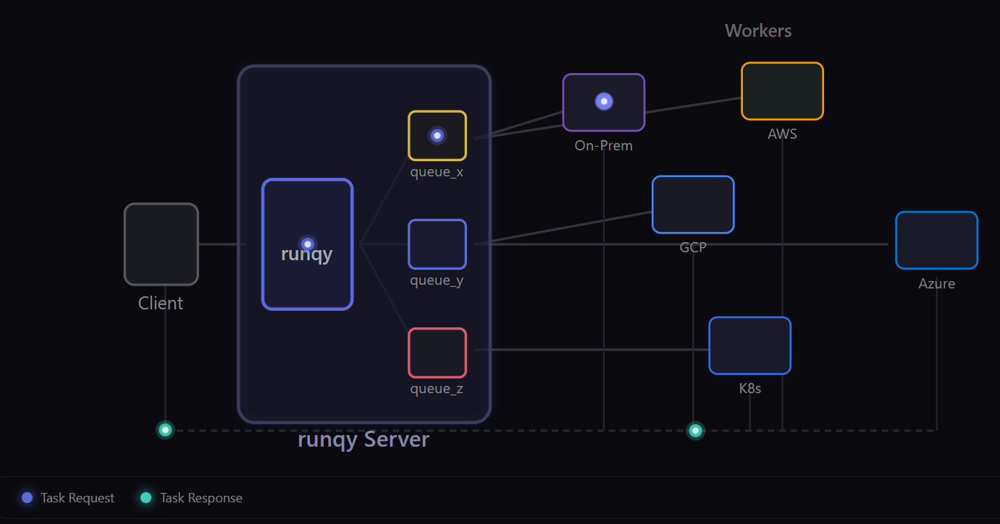
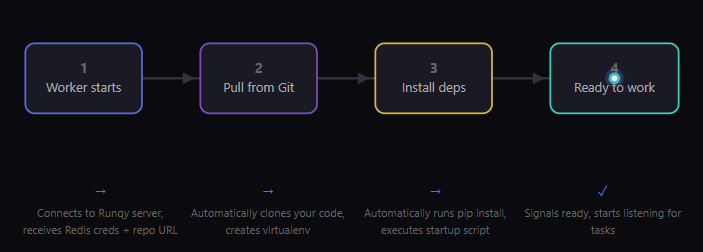

<p align="center">
  
</p>

<h1 align="center">runqy</h1>

<p align="center">
  A distributed task queue system with server-driven bootstrap architecture.
  <br>
  <a href="https://docs.runqy.com"><strong>Documentation</strong></a> · <a href="https://runqy.com"><strong>Website</strong></a>
</p>

<p align="center">
  Built on <a href="https://github.com/hibiken/asynq">asynq</a>
</p>

## Features

- REST API for enqueueing and monitoring tasks
- Redis-backed persistent queue with retry support
- PostgreSQL storage for queue worker configurations
- YAML-based queue worker definitions with schema validation
- Built-in web dashboard for real-time monitoring
- Prometheus metrics endpoint (`/metrics`) for advanced monitoring and alerting
- Swagger API documentation
- Hot-reload of queue configurations (file watching or git polling)

## Why runqy?

**Your workers, your machines, your rules.**

- **Use hardware you already have** — Your gaming GPU, lab server, or cloud VMs. Anything can become a worker.
- **No vendor lock-in** — Mix providers freely: on-prem, AWS, GCP, Lambda. Your code stays the same.
- **Free and open source** — No per-task pricing. Self-host the broker, run workers anywhere.
- **Zero migration pain** — Switching providers? Moving in-house? Workers move, code doesn't change.

## How It Works

<p align="center">
  
</p>

Tasks flow from clients through the runqy server to queues, then to workers running anywhere—on-premise servers, AWS, GCP, Azure, or Kubernetes. Results return through the same path.

## Zero-touch Deployment

<p align="center">
  
</p>

Workers are stateless. On startup, they connect to the runqy server, pull your code from Git, install dependencies, and start processing—no manual setup required. Update your code, and workers automatically pick up changes on their next restart.

## Installation

### Quick Install

**Linux/macOS:**
```bash
curl -fsSL https://raw.githubusercontent.com/publikey/runqy/main/install.sh | sh
```

**Windows (PowerShell):**
```powershell
iwr https://raw.githubusercontent.com/publikey/runqy/main/install.ps1 -useb | iex
```

### Docker

```bash
docker pull ghcr.io/publikey/runqy:latest
```

## Requirements

- Redis
- PostgreSQL (only for production - SQLite is embedded for development)

## Quick Start

The fastest way to try runqy:

```bash
curl -O https://raw.githubusercontent.com/Publikey/runqy/main/docker-compose.quickstart.yml
docker-compose -f docker-compose.quickstart.yml up -d
```

Then visit http://localhost:3000/monitoring/

See the [Quickstart Guide](https://docs.runqy.com/getting-started/quickstart/) for full walkthrough including enqueueing tasks, or check [Installation Methods](https://docs.runqy.com/getting-started/installation/) for other setup options.

## CLI

runqy includes a CLI for managing queues, tasks, and workers locally or remotely.

```bash
runqy queue list          # List queues
runqy task enqueue -q myqueue -p '{"data":"value"}'
runqy worker list         # List workers
```

See [CLI Reference](https://docs.runqy.com/server/cli/) for full documentation.

## Configuration

Configure via environment variables or YAML files. Key variables:
- `REDIS_HOST`, `REDIS_PASSWORD` - Redis connection
- `RUNQY_API_KEY` - API authentication
- `QUEUE_WORKERS_DIR` - Path to queue YAML configs

See [Configuration Reference](https://docs.runqy.com/server/configuration/) for full documentation.

## Monitoring

The web dashboard at `/monitoring` provides real-time visibility into queues, tasks, and workers. On first access, you'll be prompted to create an admin account to secure the dashboard.

For advanced monitoring, runqy exposes Prometheus metrics at `/metrics`:

```yaml
# prometheus.yml
scrape_configs:
  - job_name: 'runqy'
    static_configs:
      - targets: ['localhost:3000']
```

Optionally, set `PROMETHEUS_ADDRESS` to enable time-series charts in the dashboard:
```bash
export PROMETHEUS_ADDRESS=http://localhost:9090
```

See [Monitoring Guide](https://docs.runqy.com/guides/monitoring/) for full documentation including Grafana dashboards and alerting.

## See Also

- [asynq](https://github.com/hibiken/asynq) - The distributed task queue library that powers runqy
- [runqy-worker](https://github.com/Publikey/runqy-worker) - Task processor ([Docker images](https://ghcr.io/publikey/runqy-worker))
- [runqy-python](https://github.com/Publikey/runqy-python) - Python SDK
- [Documentation](https://docs.runqy.com) - Full documentation

## License

MIT License - see [LICENSE](LICENSE) for details.
